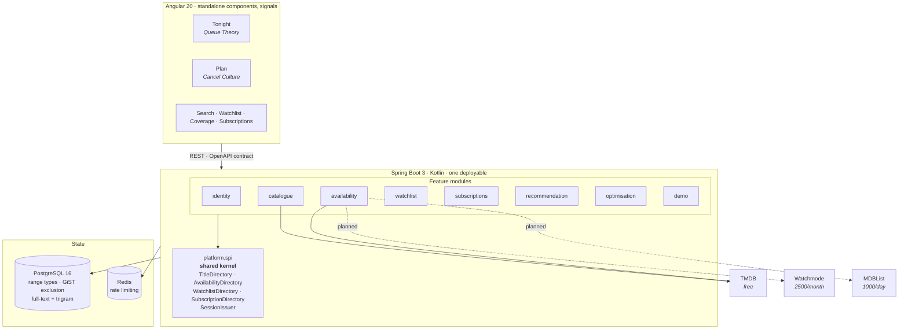
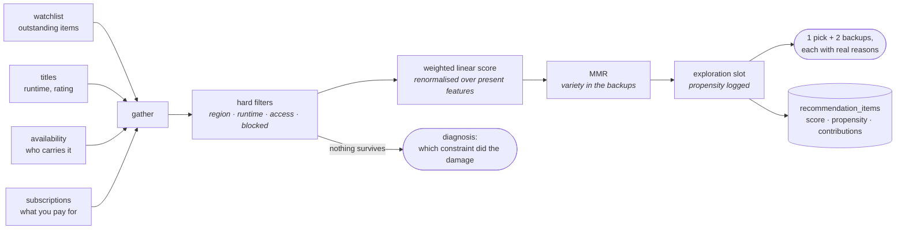
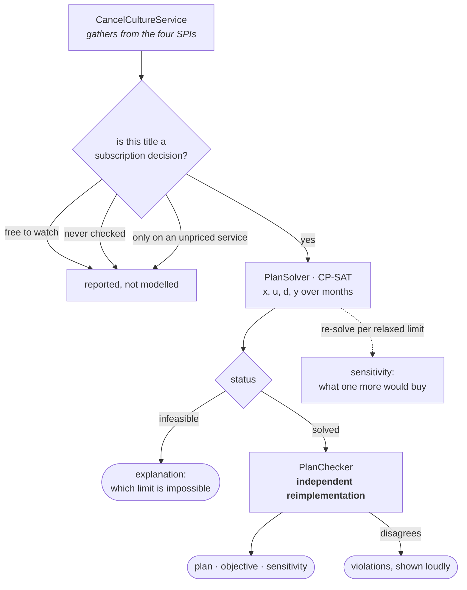
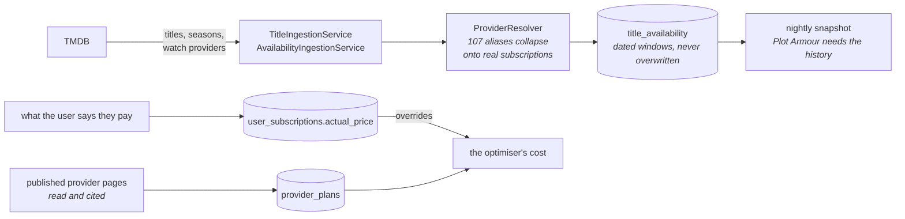
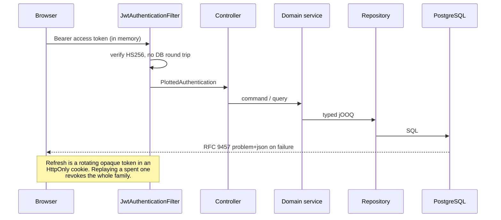

# Architecture

What Plotted is made of, and why each piece is where it is. Written for someone
reading the repository cold — including a future me.

The decisions with real trade-offs have their own ADRs in [adr/](adr/); this is
the map that shows how they fit together.

---

## The shape of it

**No feature module imports another.** They reach each other through interfaces
in `platform.spi`, and `ModuleBoundaryTest` fails the build on a violation
rather than leaving it to code review. That is the whole of what "modular
monolith" means here: splitting into services would enforce the same boundaries
at the cost of a network hop, a deployment topology and distributed failure
modes that the expected scale does not justify
([ADR 0001](adr/0001-modular-monolith-with-enforced-boundaries.md),
[ADR 0008](adr/0008-cross-module-reads-through-the-shared-kernel.md)).

---

## The two headline features

### Queue Theory — what to watch tonight

Three decisions here are load-bearing and easy to undo by accident:

- **A missing feature is absent, never zero.** Scores are renormalised over the
  features a candidate actually has, or the ranking silently becomes a ranking of
  metadata completeness.
- **Overshoot is a hard filter, not a penalty.** No amount of being otherwise
  perfect makes a three-hour film fit ninety minutes.
- **Propensity is logged at the moment of choosing.** It is one numeric column,
  it cannot be reconstructed later, and every off-policy estimator in the
  evaluation harness divides by it.

### Cancel Culture — which subscriptions to keep

`PlanChecker` was written **before** the solver so its logic could not be shaped
by the model it audits, and it shares no code with the model builder. Every
number the user sees is recomputed by it rather than read back out of CP-SAT —
a solver will optimally solve a model you specified wrong, and the result is
indistinguishable from a correct answer.

---

## Where correctness is enforced

Most of the interesting decisions in Plotted are enforced somewhere that can
fail the build, because a convention nothing checks is a convention that decays.

| Property | What enforces it |
|---|---|
| No feature module imports another | `ModuleBoundaryTest` (ArchUnit) |
| Two DTOs cannot share a schema name | `ModuleBoundaryTest.apiClassNamesAreUnique` |
| No overlapping availability windows or price periods | GiST exclusion constraints, asserted by the migrations CI job |
| Every foreign key is indexed | migrations CI job |
| The committed OpenAPI document matches the API | `OpenApiContractTest` |
| The optimiser's plan obeys the rules | `PlanChecker`, on every response |
| The optimiser's plan is *optimal* | `PlanSolverAgreementTest` — exhaustive search, scored by the checker alone |
| A real account can never carry an expiry | `CHECK` constraint on `users` |
| Demo accounts always expire | `CHECK` constraint on `users` |

The pattern behind that table is the most useful thing this project has taught
me, and it is written up in [NEXT.md](NEXT.md): **be suspicious of any check
that has never had the chance to fail.** Five separate bugs here were mechanisms
that reported success while doing nothing.

---

## Data and its provenance

Two rules run through all of it:

- **Availability is opened and closed, never overwritten.** Every offer carries
  its source, when it was last verified and a confidence. That is what lets
  Plotted be wrong gracefully — a stale price is hidden while the presence claim
  is kept.
- **No number is invented.** Provider prices were read from published sources on
  a stated date and the migration records which. Where a service has no
  established price, the optimiser leaves it out and *says so* rather than
  guessing — a guessed price does not produce a visibly broken feature, it
  produces confident, wrong financial advice.

The API budgets shape the design more than anything else: Watchmode is 2500
requests a **month** and MDBList 1000 a **day**, both hard caps. The enumeration
strategy that fits inside them is in [NEXT.md](NEXT.md). Neither is ever called
from a test or a CI job.

---

## Request path

Access tokens are stateless and short-lived; the long-lived half of the pair is
an opaque rotating token in Postgres, which is what makes revocation and reuse
detection possible at all ([ADR 0003](adr/0003-in-memory-access-token-with-rotating-refresh-cookie.md)).
The revocation commits in its own transaction — the first version rolled it back
along with the rejection, so reuse detection reported success while doing
nothing.

---

## Why these technologies

| Choice | Why, in one line |
|---|---|
| **Kotlin + Spring Boot** | Null safety where the bugs are, and the JVM's operational maturity for everything else. |
| **jOOQ over JPA** | The hard parts of this schema are range types and exclusion constraints; an ORM hides exactly those. Generated from the migrations, so a clean clone builds with no database ([ADR 0004](adr/0004-jooq-generated-from-migrations.md)). |
| **PostgreSQL** | `DATERANGE` with GiST exclusion constraints makes overlapping availability windows and price periods *unrepresentable*, and full-text plus trigram search means typos still match ([ADR 0002](adr/0002-postgres-range-types-for-temporal-correctness.md)). |
| **OR-Tools CP-SAT** | The subscription problem is genuinely combinatorial over months; a greedy heuristic would be plausible and wrong. |
| **OpenAPI drift check over Pact** | The client and API live in one repository and deploy together, so a contract test buys nearly the same signal for a fraction of the effort ([ADR 0005](adr/0005-openapi-client-over-pact.md)). |
| **Angular standalone + signals** | No NgModules, no RxJS ceremony for state that is a value. |

---

## What is not built

Listed unchecked rather than omitted, which is the standing rule here.

- **The catalogue is a 119-title hand-checked seed**, not the 500 the spec asks
  for, and the ingestion pipeline has never been run end to end against live
  TMDB. Every answer Plotted gives is real; the range it chooses from is narrow.
- **Phases 8–12** — learned ranking, Pilot Season, Temporal workflows, Plot
  Armour, End Credits analytics. The tables and the propensity column that make
  them possible exist; the features do not.
