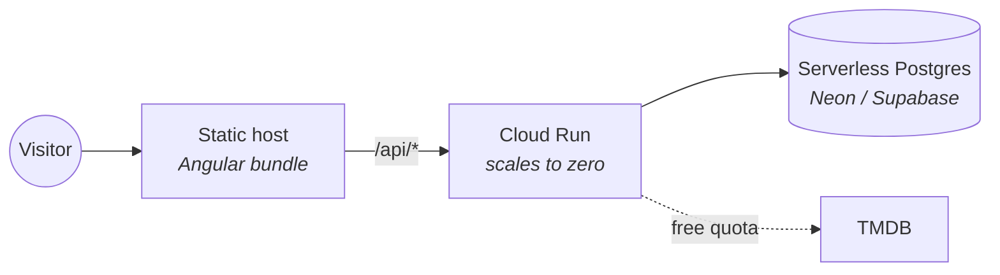

# Deployment

How to put Plotted somewhere a person can click on it, for as close to nothing
as the hosting market currently allows.

**Status: not yet deployed.** Everything below has been written and reviewed but
none of it has been executed — no image has been built (there is no Docker on
the development machine) and no environment exists. Treat this as the plan and
the checklist, not as a record of something that worked. The parts most likely
to be wrong on first contact are called out as they come up.

---

## The shape



Three pieces, and the cost argument for each:

| Piece | Choice | Why this one |
|---|---|---|
| **API** | Google Cloud Run | Scales to zero, so an idle demo costs nothing but storage. The `Dockerfile` and `application-prod.yml` were already written against it — serial GC and `MaxRAMPercentage` rather than a fixed heap, because startup time matters more than throughput when most requests arrive at a cold container. |
| **Database** | A serverless Postgres with a free tier (Neon, Supabase, or equivalent) | Needs Postgres 16 with `citext`, `pg_trgm` and `btree_gist`. Cloud SQL has no free tier and bills by the hour whether or not anyone visits. |
| **Web** | Any static host (Cloudflare Pages, Netlify, or Cloud Storage behind the same domain) | The Angular build is a folder of static files. Serving it from a container is paying for a process to hand out files that never change. |

**Check the current terms before committing to any of these.** Free tiers move,
and a document that quotes last year's allowance is worse than one that says to
go and look.

### Starting from no accounts at all

Nothing above needs to be decided in advance except one thing, and it is the one
worth deciding on evidence: **provision the database first, run the preflight
against it, and only then commit to the rest.** The database is the piece with a
real constraint attached — three extensions the schema cannot do without — and it
is much cheaper to discover a provider will not grant them before anything else
is wired to it.

The API host is the reversible choice. Cloud Run is what the `Dockerfile` and
`application-prod.yml` were written against, but the image is an ordinary Spring
Boot container and any host that runs one will do. If you would rather not think
about the scale-to-zero scheduling problem below at all, a host that keeps one
instance alive removes it entirely — see the note on `@Scheduled`.

---

## Before the first deploy

### 1. The database must have three extensions

**Run the preflight first.** It is the one step that turns the most likely
first-deploy failure into a five-second answer:

```bash
psql "$PLOTTED_DB_URL" -v ON_ERROR_STOP=1 -f ops/deploy/preflight.sql
```

No psql? It is plain SQL with no meta-commands, so it pastes straight into a
provider's browser console.

`V1__extensions.sql` creates `citext`, `pg_trgm` and `btree_gist`, so a role with
`CREATE EXTENSION` rights makes this automatic. Some managed Postgres providers
restrict that; on those, enable the three from the provider's console **before**
the first migration runs.

This is the most likely first-deploy failure and the least obvious: without
`btree_gist` the exclusion constraints do not exist, and their absence is the
thing that makes duplicate availability rows possible — which inflates every
coverage number the optimiser depends on. It fails loudly at migration time,
which is the good case. Do not be tempted to fence those constraints out to get
past it.

**The preflight checks more than the three names**, because "the extension is
listed" and "the exclusion constraint fires" are different claims. It builds a
constraint of the same shape `title_availability` uses — a `DATERANGE` keyed by
two scalar columns, which is exactly the combination that needs `btree_gist` —
and asserts that an overlapping range is *rejected*. If it is accepted, the
script raises and says not to deploy. A guard nobody has watched fail is a guard
nobody knows is there.

It runs on every CI build, against the clean database in the migrations job, at
the same point in the sequence the real one would. A preflight nobody executes
is a preflight that has quietly stopped matching the schema.

### 2. Generate a real JWT secret

```bash
openssl rand -base64 48
```

`SecurityConfig` refuses to start with the development default outside the `dev`
profile, so this is enforced rather than remembered.

### 2b. Check the environment before building anything

```bash
make check-env
```

Once the TMDB token is set, it is also worth checking the seed list resolves
before asking a deployment to ingest it:

```bash
python tools/seed/validate_seed.py
```

400 free TMDB requests, no database, a few minutes. It reports ids that do not
resolve, ids that exist under the *other* media type, and — the one that matters
most — titles with **no runtime**, which ingest fine and are then invisible to
Tonight Mode's time filter, because that filter is a hard one. A seed full of
runtime-less titles produces a recommender that mysteriously refuses to answer.

**Run 2026-08-14, and the result is the reason to run it.** 408 derived ids:
**0 do not resolve, 0 are the wrong media type, 0 films lack a runtime**, and 152
series carry no `episode_run_time`.

That last number looks alarming and is not. TMDB leaves `episode_run_time` empty
for most shows, and `SeasonRepository.recalculateTotalRuntime` stopped depending
on it — it derives the typical episode from the episodes it is already summing,
which is what took the seeded catalogue from 77 of 260 series with an episode
length to 260 of 260. **Films are the case that would actually block**, because
there is nothing to derive a length from, and there are none.

The script's first version reported all 152 as one undifferentiated
"runtime-less" count, which would have sent somebody to fix data that fixes
itself. It splits them now, and `tools/seed/validation-report.md` is committed as
the evidence.

Two seconds, and it catches the class of mistake that otherwise surfaces from a
log after a five-minute image build. The one worth naming: **a missing
`TMDB_READ_ACCESS_TOKEN` boots perfectly happily** and then serves empty screens,
because nothing on a developer machine without a database ever asks TMDB for
anything. It was empty in `.env` for most of development and nothing noticed;
`check-env` is what found it, and it is set now. A missing JWT secret at least
fails loudly; this one does not.

### 3. Decide what the deployment is for

| Variable | Demo deployment | Anything else |
|---|---|---|
| `PLOTTED_DEMO_ENABLED` | `true` | `false` — it is an unauthenticated write |
| `PLOTTED_SEED_ENABLED` | `true` for the first boot, then `false` | `false` |
| `PLOTTED_SNAPSHOT_ENABLED` | `true` | `true` if it runs continuously |
| `TMDB_READ_ACCESS_TOKEN` | required | required for any ingestion |

`PLOTTED_SNAPSHOT_ENABLED` deserves a note. Plot Armour (phase 10) needs months
of nightly availability history and **a night not collected cannot be
recovered**. The first environment that runs continuously should turn it on
immediately, not when phase 10 starts.

And a warning about scale-to-zero: **Cloud Run does not run scheduled jobs on an
idle container.** The nightly snapshot and the hourly demo sweep are Spring
`@Scheduled` methods, so they only fire while an instance is alive. Either set a
minimum instance count of 1 on the service, or drive both from Cloud Scheduler
against an endpoint. Deploying with neither means the snapshot silently never
runs — which looks exactly like it running and finding nothing.

---

## Deploying

### API

```bash
make deploy
```

`ops/deploy/deploy.sh` runs `check-env` first so a bad environment fails in two
seconds rather than after an image build, then deploys and verifies. Region
defaults to `northamerica-northeast1` because the product is Canada-only and the
database should be beside it; `--source .` uses the repository-root build context
the `Dockerfile` expects.

**Scaling defaults to min 0, max 3.** The maximum matters because Cloud Run's
default is high and scale-to-zero saves nothing if a crawler scales you to fifty.
The minimum is the real decision: at zero the nightly snapshot never fires, so
`PLOTTED_MIN_INSTANCES=1` is what starts Plot Armour's history. The script says
so rather than leaving it to be discovered.

Once the secrets exist in Secret Manager, prefer `--set-secrets` over the env
vars the script uses — an environment variable set on the command line is in your
shell history and in the revision description, and both are readable by anyone
with view access. The script uses env vars because Secret Manager needs the
secrets created first, and creating them is a person's job.

### Web

```bash
cd plotted-web && npm run build
```

Then upload `dist/plotted-web/browser` to the static host. The one thing that
must be right: `/api/*` has to reach the Cloud Run service on the **same origin**
as the page. The refresh token is an `HttpOnly` `SameSite=Lax` cookie scoped to
`/api/v1/auth`, and a cross-origin split breaks session persistence in a way
that looks like random sign-outs rather than a configuration error.

**`plotted-web/public/_redirects` is the Cloudflare Pages half of that**, and it
ships in the build already. Replace `PLOTTED_API_HOST` in it with the Cloud Run
URL before uploading — it is a placeholder because the file is committed and the
host is not known until the API exists. It proxies with a `200` rather than a
redirect, because a redirect would change the origin in the address bar, which is
the thing being prevented.

If the static host cannot proxy, set `plotted.cors.allowed-origins` to the web
origin and expect to revisit the cookie's `SameSite` — that is a real trade-off,
not a checkbox, and `SameSite=None` requires `Secure` and a reason.

### Seeding

First boot only, with `PLOTTED_SEED_ENABLED=true`. It resolves **519 seed entries**
— 400 by tmdb id, 119 by TMDB search — and ingests each with its Canadian
availability, which is free quota but takes several minutes. Then **turn it off**:
it is idempotent, so leaving it on is not destructive, but it re-pulls the whole
seed on every cold start, and on a scale-to-zero service that is every few
minutes.

The run reports created, refreshed, unmatched and incomplete. **That report is
the number to quote for how many titles the catalogue actually has**, because the
519 entries overlap — the curated names resolve to ids some of which the derived
half already lists.

---

## Verifying it actually works

```bash
make verify-deploy HOST=https://your-api-host
```

`make deploy` runs this automatically. It does three checks in a deliberate
order, because each tells you something the previous cannot — and running them
out of order means diagnosing the wrong layer.

**1. `/actuator/health`.** Expect `{"status":"UP"}`. If it is `DOWN`, read the
components. **Redis being `DOWN` is expected and harmless**: it has exactly one
caller, the rate limiter, and it is deliberately excluded from the readiness
group so a Redis outage degrades limiting rather than removing every instance
from the load balancer.

**2. `/api/v1/providers`.** Reference data from the migrations. Empty means
Flyway did not run — check the startup logs for the extension-permission failure
before looking anywhere else.

**3. `POST /api/v1/demo/session`.** The demo path end to end. Three answers worth
telling apart:

- `404` — demo mode is off. Expected on a non-demo deployment.
- `"catalogueIsEmpty": true` — the account was created but the seed has not run,
  so the demo will show two empty screens. The response says so rather than
  leaving you to guess whether the features are broken.
- A session against a populated catalogue — done.

---

## Cost control

- **Set a maximum instance count.** Cloud Run's default is high, and the point of
  scale-to-zero is lost if a crawler can scale it to fifty.
- **Set a billing alert before the first deploy, not after.** The failure mode of
  a free tier is not a hard stop.
- **The demo endpoint has its own ceiling** (`maximum-live-accounts`, 500 by
  default) and refuses past it rather than degrading. That ceiling exists because
  the endpoint is unauthenticated and writes: a demo that is briefly unavailable
  is recoverable, and a free-tier database filled by a script is not.
- **Never put a quota'd API key on a public deployment without a limit in front
  of it.** Watchmode is 2500 requests a *month* and MDBList 1000 a *day*, both
  hard caps with no way to buy more. Neither is called by anything today, and
  neither should be reachable from a user request when they are.

---

## What has not been verified

Being specific, because "should work" is not a status:

- **No image has ever been built.** There is no Docker on the development
  machine, so both `Dockerfile`s are unexecuted. `bootJar` itself is built in CI
  and does work.
- **`deploy.sh` has never been run.** `check-env.sh` and `verify.sh` have —
  against the local `.env` and against an unreachable host respectively, which is
  how the empty TMDB token was found and how the failure paths were exercised.
  The `gcloud` call between them is unexecuted.
- **No migration has run against a managed Postgres**, only against
  `postgres:16-alpine` in CI. The extension-permission problem above is the
  known risk.
- **The scheduled jobs have never run anywhere.** Neither the snapshot nor the
  demo sweep has executed outside a test.
- **The same-origin cookie path is reasoned about, not observed.** It is the
  thing most likely to be subtly wrong on the first deploy.
